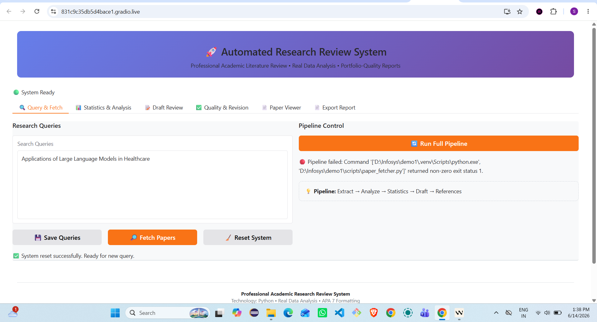
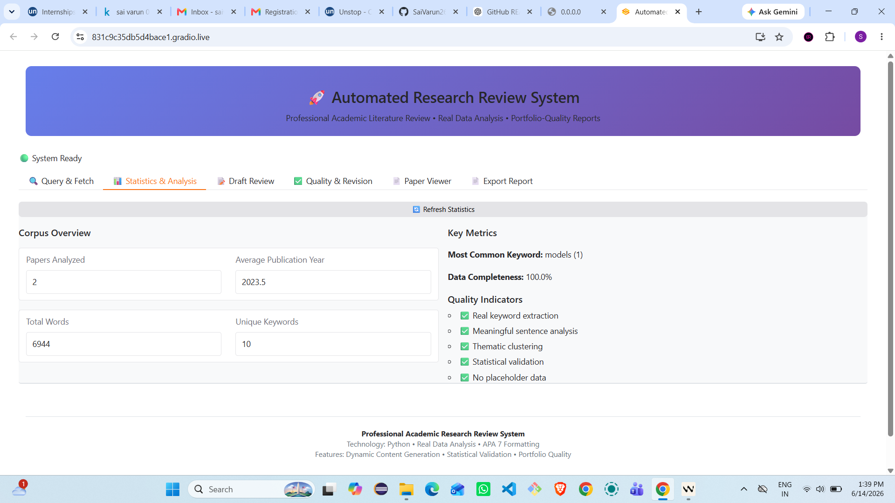
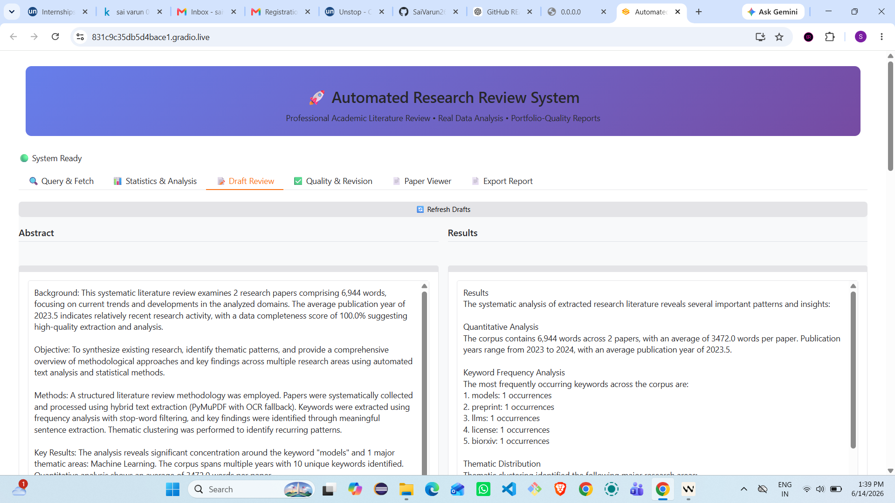
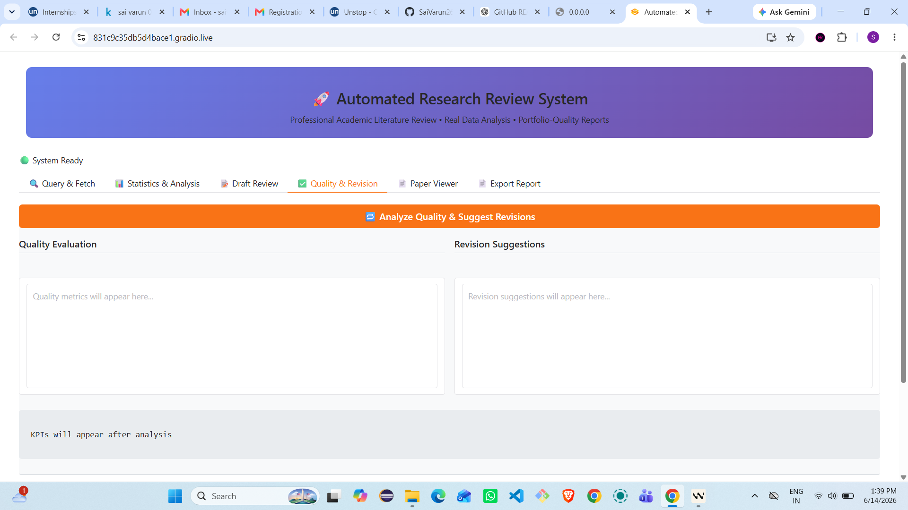

# 🚀 AI System to Automatically Review and Summarize Research Papers

<div align="center">


**An automated AI-powered system for systematic literature review and academic research synthesis**

[Features](#-key-features) • [Architecture](#-system-architecture) • [Installation](#-installation-guide) • [Usage](#-running-the-application) • [API](#-api-requirements)

</div>

---

## 📖 Project Description

This is an intelligent, automated research review system that leverages cutting-edge AI technologies to search, download, analyze, compare, summarize, critique, and generate systematic review drafts from academic research papers. The system streamlines the literature review process by automating time-consuming tasks, enabling researchers to focus on analysis and interpretation.

### 🎯 Primary Goals

- **Automated Paper Discovery**: Search and retrieve relevant academic papers using Semantic Scholar API
- **Intelligent Content Extraction**: Extract and process text from PDF documents using advanced OCR techniques
- **AI-Powered Analysis**: Analyze research content using LLMs (Gemini/OpenAI) to identify key findings and themes
- **Systematic Review Generation**: Automatically generate comprehensive literature review drafts following academic standards
- **Quality Assurance**: Built-in quality checks and revision suggestions for generated content
- **APA 7 Formatting**: Generate properly formatted references and citations

---

## ✨ Key Features

| Feature | Description |
|---------|-------------|
| 🔍 **Smart Paper Search** | Query Semantic Scholar API with custom search terms and filters |
| 📄 **PDF Processing** | Extract text from PDFs using PyMuPDF4LLM with high accuracy |
- 🧠 **AI Analysis** | Use Gemini/OpenAI LLMs to extract key findings, themes, and insights |
| 📊 **Statistics Engine** | Compute comprehensive statistics on research corpus |
| 📝 **Draft Generation** | Automatically generate systematic review sections (Abstract, Introduction, Methods, Results, Discussion) |
| ✅ **Quality Control** | Built-in quality checks and revision suggestions |
| 📚 **APA Formatting** | Generate properly formatted APA 7 references |
| 🎨 **Professional UI** | Clean, intuitive Gradio interface for easy interaction |
| 🔄 **Pipeline Automation** | End-to-end automated workflow from query to final report |

---

## 🏗️ System Architecture

```
┌─────────────────────────────────────────────────────────────────┐
│                     GRADIO WEB INTERFACE                         │
│  (Query Input • Pipeline Control • Results Display • Export)    │
└───────────────────────────┬─────────────────────────────────────┘
                            │
                            ▼
┌─────────────────────────────────────────────────────────────────┐
│                    PIPELINE RUNNER                               │
│         (Orchestrates all modules in sequence)                  │
└───────────────────────────┬─────────────────────────────────────┘
                            │
        ┌───────────────────┼───────────────────┐
        │                   │                   │
        ▼                   ▼                   ▼
┌──────────────┐   ┌──────────────┐   ┌──────────────┐
│ PAPER        │   │ TEXT         │   │ KEY          │
│ FETCHER      │   │ EXTRACTOR    │   │ FINDINGS     │
│              │   │              │   │              │
│ Semantic     │   │ PyMuPDF4LLM  │   │ LLM Analysis │
│ Scholar API  │   │ PDF Processing│  │ Gemini/OpenAI│
└──────────────┘   └──────────────┘   └──────────────┘
        │                   │                   │
        └───────────────────┼───────────────────┘
                            │
                            ▼
┌─────────────────────────────────────────────────────────────────┐
│              STATISTICS ENGINE & ANALYSIS                        │
│         (Compute metrics • Identify themes • Validate data)      │
└───────────────────────────┬─────────────────────────────────────┘
                            │
                            ▼
┌─────────────────────────────────────────────────────────────────┐
│              DRAFT GENERATION ENGINE                             │
│    (Abstract • Introduction • Methods • Results • Discussion)    │
└───────────────────────────┬─────────────────────────────────────┘
                            │
                            ▼
┌─────────────────────────────────────────────────────────────────┐
│              QUALITY CHECK & REVISION                           │
│         (Validate content • Suggest improvements • Refine)      │
└───────────────────────────┬─────────────────────────────────────┘
                            │
                            ▼
┌─────────────────────────────────────────────────────────────────┐
│              PDF EXPORT & FORMATTING                             │
│         (APA 7 references • Professional layout • Download)     │
└─────────────────────────────────────────────────────────────────┘
```

---

## 📁 Folder Structure

```
demo1/
├── .env                          # Environment variables (API keys)
├── .gitignore                    # Git ignore rules
├── requirements.txt             # Python dependencies
├── queries.txt                   # Research queries
├── README.md                     # Project documentation
├── LICENSE                       # MIT License
├── CONTRIBUTING.md               # Contribution guidelines
├── CHANGELOG.md                  # Version history
├── scripts/                      # Main application scripts
│   ├── __init__.py
│   ├── app.py                    # Gradio web interface
│   ├── paper_fetcher.py          # Semantic Scholar API integration
│   ├── extract_text.py          # PDF text extraction
│   ├── key_findings.py           # LLM-powered analysis
│   ├── statistics_engine.py      # Statistical analysis
│   ├── draft_generator_llm.py    # Draft generation
│   ├── quality_check.py          # Quality validation
│   ├── revision_suggestions.py   # Revision recommendations
│   ├── pdf_export.py             # PDF report generation
│   ├── pipeline_runner.py        # Pipeline orchestration
│   ├── apa_formatter.py          # APA 7 formatting
│   ├── milestone3_generate.py    # Reference generation
│   ├── cross_compare.py          # Cross-paper comparison
│   ├── section_parser.py         # Section parsing utilities
│   └── final_report.py           # Final report assembly
├── research/                     # Research data directory
│   ├── papers.json               # Paper metadata
│   ├── pdfs/                     # Downloaded PDFs
│   ├── extracted_text/           # Extracted text files
│   ├── analysis/                 # Analysis results
│   │   ├── key_findings.json     # Key findings
│   │   └── comprehensive_statistics.json
│   └── drafts/                   # Generated drafts
│       ├── abstract.txt
│       ├── introduction.txt
│       ├── methods.txt
│       ├── results.txt
│       ├── discussion.txt
│       └── references.txt
├── tests/                        # Test files
└── .venv/                        # Virtual environment
```

---

## 🛠️ Technology Stack

### Core Technologies
- **Python 3.9+**: Primary programming language
- **Gradio 4.40+**: Web UI framework
- **LangChain & LangGraph**: LLM orchestration and workflow management

### AI & ML
- **OpenAI API**: GPT models for analysis
- **Google Gemini API**: Advanced AI capabilities
- **LangSmith**: LLM application monitoring

### Data Processing
- **PyMuPDF4LLM**: PDF text extraction
- **pdfplumber**: Alternative PDF processing
- **requests**: HTTP client for API calls

### Utilities
- **python-dotenv**: Environment variable management
- **PyYAML**: Configuration management
- **tqdm**: Progress bars
- **tenacity**: Retry logic
- **rich**: Terminal formatting
- **pytest**: Testing framework

---

## 📦 Installation Guide

### Prerequisites

- Python 3.9 or higher
- pip (Python package manager)
- Semantic Scholar API key
- Gemini API key (optional, for enhanced features)

### Step 1: Clone the Repository

```bash
git clone https://github.com/yourusername/ai-research-review-system.git
cd ai-research-review-system
```

### Step 2: Create Virtual Environment

```bash
# Windows
python -m venv .venv
.venv\Scripts\activate

# Linux/Mac
python3 -m venv .venv
source .venv/bin/activate
```

### Step 3: Install Dependencies

```bash
pip install -r requirements.txt
```

### Step 4: Configure Environment Variables

Create a `.env` file in the project root:

```env
S2_API_KEY=your_semantic_scholar_api_key
GEMINI_API_KEY=your_gemini_api_key
```

**Getting API Keys:**

- **Semantic Scholar API**: Register at [https://www.semanticscholar.org/product/api#api-key](https://www.semanticscholar.org/product/api#api-key)
- **Gemini API**: Get your key at [https://aistudio.google.com/app/apikey](https://aistudio.google.com/app/apikey)

---

## 🚀 Running the Application

### Start the Gradio Interface

```bash
python scripts/app.py
```

The application will start and provide:
- **Local URL**: http://127.0.0.1:7863
- **Public URL**: A shareable Gradio link (expires in 1 week)

### Using the Web Interface

1. **Query & Fetch Tab**
   - Enter your research queries (one per line)
   - Click "Fetch Papers" to search Semantic Scholar
   - Click "Run Full Pipeline" to process papers

2. **Statistics & Analysis Tab**
   - View corpus statistics
   - Analyze publication trends
   - Review keyword frequencies

3. **Draft Review Tab**
   - Read generated sections
   - Refresh to see latest drafts

4. **Quality & Revision Tab**
   - Run quality checks
   - Get revision suggestions
   - View KPI metrics

5. **Paper Viewer Tab**
   - Browse downloaded PDFs
   - Preview papers inline
   - Download for offline reading

6. **Export Report Tab**
   - Generate academic PDF
   - Download final report

---

## 📚 Module Explanations

### 📥 Paper Retrieval Module (`paper_fetcher.py`)
- Integrates with Semantic Scholar API
- Searches papers by query and year
- Downloads PDFs with metadata
- Handles rate limiting and retries

### 📄 PDF Extraction Module (`extract_text.py`)
- Extracts text from PDF documents
- Uses PyMuPDF4LLM for high accuracy
- Handles multi-page documents
- Saves extracted text as JSON

### 🧠 Analysis Module (`key_findings.py`)
- Uses LLMs to extract key findings
- Identifies important keywords
- Summarizes research contributions
- Generates structured analysis

### 📊 Statistics Engine (`statistics_engine.py`)
- Computes comprehensive corpus statistics
- Analyzes publication trends
- Identifies thematic clusters
- Validates data quality

### 📝 Draft Generation Module (`draft_generator_llm.py`)
- Generates systematic review sections
- Uses real data from analysis
- Follows academic writing standards
- Creates coherent narratives

### ✅ Quality Check Module (`quality_check.py`)
- Validates generated content
- Checks for completeness
- Identifies potential issues
- Provides quality metrics

### 🔧 Revision Suggestions Module (`revision_suggestions.py`)
- Suggests improvements
- Identifies weak sections
- Provides actionable feedback
- Enhances content quality

### 📄 PDF Export Module (`pdf_export.py`)
- Generates professional PDF reports
- Applies APA 7 formatting
- Creates title pages
- Formats references correctly

---

## 🔬 Research Workflow

```
1. INPUT TOPIC
   ↓
2. SEARCH PAPERS
   ↓
3. SELECT PAPERS
   ↓
4. DOWNLOAD PDFs
   ↓
5. EXTRACT TEXT
   ↓
6. ANALYZE CONTENT
   ↓
7. COMPARE FINDINGS
   ↓
8. GENERATE DRAFT
   ↓
9. CRITIQUE DRAFT
   ↓
10. REVISE DRAFT
    ↓
11. FINAL REVIEW PAPER
```

### Detailed Steps

1. **Input Topic**: Enter research queries in the Query & Fetch tab
2. **Search Papers**: System queries Semantic Scholar API for relevant papers
3. **Select Papers**: Papers are automatically selected based on relevance
4. **Download PDFs**: PDFs are downloaded to `research/pdfs/`
5. **Extract Text**: Text is extracted using PyMuPDF4LLM
6. **Analyze Content**: LLMs analyze content for key findings and themes
7. **Compare Findings**: Cross-paper comparison identifies patterns
8. **Generate Draft**: Systematic review sections are generated
9. **Critique Draft**: Quality checks validate the content
10. **Revise Draft**: Suggestions are provided for improvements
11. **Final Review Paper**: Professional PDF is generated for download

---

## 📸 Screenshots

<details>
<summary>Click to view screenshots</summary>

### Main Interface


### Query & Fetch Tab


### Statistics Dashboard


### Draft Review


### Quality Check


*Note: Screenshots will be added in future updates*
</details>

---

## 🔑 API Requirements

### Semantic Scholar API
- **Purpose**: Paper search and metadata retrieval
- **Endpoint**: https://api.semanticscholar.org/graph/v1
- **Rate Limit**: 100 requests per 5 minutes (free tier)
- **Authentication**: API key required
- **Documentation**: https://api.semanticscholar.org/api-docs/

### Gemini API
- **Purpose**: AI-powered content analysis and generation
- **Endpoint**: https://generativelanguage.googleapis.com
- **Rate Limit**: Varies by plan
- **Authentication**: API key required
- **Documentation**: https://ai.google.dev/docs

---

## ⚠️ Limitations

- **API Rate Limits**: Subject to Semantic Scholar and Gemini API rate limits
- **PDF Quality**: Extraction accuracy depends on PDF quality and formatting
- **Language Support**: Primarily optimized for English-language papers
- **Internet Connection**: Requires active internet connection for API calls
- **LLM Accuracy**: Generated content depends on LLM model capabilities
- **Storage Space**: PDFs and extracted text require disk space

---

## 🚀 Future Improvements

- [ ] Support for additional academic databases (arXiv, PubMed)
- [ ] Multi-language support for non-English papers
- [ ] Advanced citation network analysis
- [ ] Collaborative review features
- [ ] Integration with reference managers (Zotero, Mendeley)
- [ ] Customizable templates for different review types
- [ ] Batch processing for large-scale reviews
- [ ] Real-time collaboration features
- [ ] Export to multiple formats (Word, LaTeX)
- [ ] Advanced visualization of research networks

---

## 🤝 Contributing

Contributions are welcome! Please read [CONTRIBUTING.md](CONTRIBUTING.md) for details on our code of conduct and the process for submitting pull requests.

### Development Setup

```bash
# Clone the repository
git clone https://github.com/yourusername/ai-research-review-system.git
cd ai-research-review-system

# Create virtual environment
python -m venv .venv
source .venv/bin/activate  # or .venv\Scripts\activate on Windows

# Install dependencies
pip install -r requirements.txt

# Run tests
pytest tests/
```

---

## 👥 Contributors

- **[Your Name]** - Initial development
- **[Contributor Name]** - Feature enhancements
- **[Contributor Name]** - Bug fixes and improvements

---

## 📄 License

This project is licensed under the MIT License - see the [LICENSE](LICENSE) file for details.

---

## 🙏 Acknowledgements

- **Semantic Scholar** for providing the academic paper search API
- **Google** for the Gemini AI API
- **Gradio Team** for the excellent web UI framework
- **LangChain Community** for the LLM orchestration tools
- **OpenAI** for GPT model access

---

## 📞 Support

For support, please open an issue on GitHub or contact [your-email@example.com].

---

<div align="center">

**Made with ❤️ for the research community**

[⬆ Back to Top](#-ai-system-to-automatically-review-and-summarize-research-papers)

</div>
